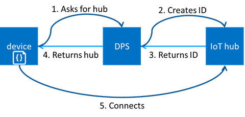

# AZURE Research on Connectivity <!-- omit in toc -->

## Table of content <!-- omit in toc -->

- [IoT Central Notes](#iot-central-notes)
  - [Get connected to Azure IoT Central](#get-connected-to-azure-iot-central)
  - [IoT Hub](#iot-hub)
  - [IoT Hub Device Provisioning](#iot-hub-device-provisioning)
  - [Shared Access Signature (SAS)](#shared-access-signature-sas)
  - [Implement the device](#implement-the-device)
  - [Software Development Kit](#software-development-kit)
- [IoT Hub Notes](#iot-hub-notes)
- [Azure IoT Hub Device Provisioning Service](#azure-iot-hub-device-provisioning-service)
  - [Security concepts](#security-concepts)
  - [Service concepts in Azure IoT Hub Device Provisioning Service](#service-concepts-in-azure-iot-hub-device-provisioning-service)
  - [Symmetric key attestation](#symmetric-key-attestation)

## IoT Central Notes

### Get connected to Azure IoT Central

Types of device:

- **Standalone device**: a standalone device connects directly to IoT Central. A standalone device typically sends telemetry from its onboard or connected sensors to your IoT Central application. Standalone devices can also report property values, receive writable property values, and respond to commands.
- **Gateway device**: A gateway device manages one or more downstream devices that connect to your IoT Central application. You use IoT Central to configure the relationships between the downstream devices and the gateway device. To learn more, see Define a new IoT gateway device type in your Azure IoT Central application.
- **Edge device** - An edge device connects directly to IoT Central, but acts as an intermediary for other devices known as leaf devices. An edge device is typically located close to the leaf devices for which it's acting as an intermediary. IoT Central only sees the edge device, not the leaf devices connected to the edge device.

> MP Comment: to fulfill our assumption we must implement **field gateway**. **field gateway** is not mentioned on this list.

Typically, a device must be registered in the IoT Central application before it can connect. However, IoT Central does support scenarios where devices can connect without first being registered.

### IoT Hub

Azure IoT Central uses Azure IoT Hub as a cloud gateway that enables device connectivity. IoT Hub enables:

- Data ingestion at scale in the cloud.
- Device management.
- Secure device connectivity.

To learn more about IoT Hub, see [Azure IoT Hub Documentation](https://docs.microsoft.com/En-us/azure/iot-hub/)

- The [IoT Hub Device Provisioning Service](https://docs.microsoft.com/azure/iot-dps/) automatically provisions devices to the right IoT hub when the device first boots up.

### IoT Hub Device Provisioning

IoT Central uses the [Azure IoT Hub Device Provisioning service (DPS)](https://docs.microsoft.com/En-us/azure/iot-dps/about-iot-dps) to manage the connection process. Using DPS enables:

- IoT Central to support onboarding and connecting devices at scale.
- You to generate device credentials and configure the devices offline without registering the devices through IoT Central UI.
- You to use your own device IDs to register devices in IoT Central. Using your own device IDs simplifies integration with existing back-office systems.
- A single, consistent way to connect devices to IoT Central.

To secure the communication between a device and your application, IoT Central supports both Shared Access Signatures (SAS) and X.509 certificates. X.509 certificates are recommended in production environments.

IoT Central also enables OEMs to mass manufacture devices that can connect without first being registered. An OEM generates suitable device credentials, and configures the devices in the factory.

> **Conclusion** MP: authentication proces must
>
> - identify the device
> - associate the device with the service
> - associate the device with the appropriate IoT Central application.
> - associate the device with the device template
>

### Shared Access Signature (SAS)

To secure the communication between a device and your application, IoT Central supports both shared access signatures (SAS) and X.509 certificates. X.509 certificates are recommended in production environments.

> MP Comments - documentation doesn't cover the topic how it works.
> To secure the communication - what it exactly means: 
>
>- authentication,
>- authorization,
>- integrity,
>- nonrepudiation,
>- encryption.

### Implement the device

Use one of the Azure IoT device SDKs to implement the behavior of your device. The code should:

- Register the device with DPS and use the information from DPS to connect to the internal IoT hub in your IoT Central application.
- Send telemetry in the format that the device template in IoT Central specifies. IoT Central uses the device template to determine how to use the telemetry for visualizations and analysis.
- Synchronize property values between the device and IoT Central. The device template specifies the property names and data types so that IoT Central can display the information.
- Implement command handlers for the commands specifies in the device template. The device template specifies the command names and parameters that the device should use.

### Software Development Kit

For more information about the supported languages and SDKs, see [Understand and use Azure IoT Hub device SDKs](https://docs.microsoft.com/en-us/azure/iot-hub/iot-hub-devguide-sdks#azure-iot-hub-device-sdks).

- [Microsoft Azure IoT SDK for .NET](https://github.com/azure/azure-iot-sdk-csharp#microsoft-azure-iot-sdk-for-net)

## IoT Hub Notes

*Device provisioning* is the process of adding the initial device data to the stores in your solution. To enable a new device to connect to your hub, you must add a device ID and keys to the IoT Hub identity registry. As part of the provisioning process, you might need to initialize device-specific data in other solution stores. You can also use the Azure IoT Hub Device Provisioning Service to enable zero-touch, just-in-time provisioning to one or more IoT hubs without requiring human intervention. To learn more, see the [provisioning service documentation](https://azure.microsoft.com/documentation/services/iot-dps).

In addition, we also provide a set of SDKs for working with the [Device Provisioning Service](../iot-dps/about-iot-dps.md).

- **Provisioning Device SDKs** enable you to build apps that run on your IoT devices to communicate with the Device Provisioning Service.
- **Provisioning Service SDKs** enable you to build backend applications to manage your enrollments in the Device Provisioning Service.

Learn about the [benefits of developing using Azure IoT SDKs](https://azure.microsoft.com/blog/benefits-of-using-the-azure-iot-sdks-in-your-azure-iot-solution/).

## Azure IoT Hub Device Provisioning Service

All these scenarios are achievable today through the Device Provisioning Service using the same basic flow:

### Security concepts

IoT Hub Device Provisioning Service is a helper service for IoT Hub that you use to configure zero-touch device provisioning to a specified IoT hub.

> [!NOTE]
> IoT Hub uses "authentication scheme" for a similar concept in that service.

Device Provisioning Service supports the following forms of attestation:

- **X.509 certificates** based on the standard X.509 certificate authentication flow.
- **Trusted Platform Module (TPM)** based on a nonce challenge, using the TPM standard for keys to present a signed Shared Access Signature (SAS) token. This form of attestation does not require a physical TPM on the device, but the service expects to attest using the endorsement key per the [TPM spec](https://trustedcomputinggroup.org/work-groups/trusted-platform-module/).
- **Symmetric Key**  based on shared access signature (SAS) [Security tokens](../iot-hub/iot-hub-devguide-security.md#security-tokens), which include a hashed signature and an embedded expiration. For more information, see [Symmetric key attestation](concepts-symmetric-key-attestation.md).

### Service concepts in Azure IoT Hub Device Provisioning Service

Device provisioning is a two part process. The first part is establishing the initial connection between the device and the IoT solution by *registering* the device. The second part is applying the proper *configuration* to the device based on the specific requirements of the solution. Once both steps have been completed, the device has been fully *provisioned*. Device Provisioning Service automates both steps to provide a seamless provisioning experience for the device.

An **enrollment** is the record of devices or groups of devices that may register through auto-provisioning.
An **enrollment group** is a group of devices that share a specific attestation mechanism.

A **registration** is the record of a device successfully registering/provisioning to an IoT Hub via the Device Provisioning Service. Registration records are created automatically; they can be deleted, but they cannot be updated.

### Symmetric key attestation

Symmetric key attestation is a simple approach to authenticating a device with a Device Provisioning Service instance.

By default, the Device Provisioning Service creates new symmetric keys with a default length of 64 bytes.

You can also provide your own symmetric keys for enrollments by disabling this option. When specifying your own symmetric keys, your keys must have a key length between 16 bytes and 64 bytes. Also, symmetric keys must be provided in valid Base64 format.

SAS tokens have the following form:

`SharedAccessSignature sig={signature}&se={expiry}&skn={policyName}&sr={URL-encoded-resourceURI}`

Here are the components of each token:

| Value | Description |
| --- | --- |
| {signature} |An HMAC-SHA256 signature string. For individual enrollments, this signature is produced by using the symmetric key (primary or secondary) to perform the hash. For enrollment groups, a key derived from the enrollment group key is used to perform the hash. The hash is performed on a message of the form: `URL-encoded-resourceURI + "\n" + expiry`. **Important**: The key must be decoded from base64 before being used to perform the HMAC-SHA256 computation. Also, the signature result must be URL-encoded. |
| {resourceURI} |URI of the registration endpoint that can be accessed with this token, starting with scope ID for the Device Provisioning Service instance. For example, `{Scope ID}/registrations/{Registration ID}` |
| {expiry} |UTF8 strings for number of seconds since the epoch 00:00:00 UTC on 1 January 1970. |
| {URL-encoded-resourceURI} |Lower case URL-encoding of the lower case resource URI |
| {policyName} |The name of the shared access policy to which this token refers. The policy name used when provisioning with symmetric key attestation is **registration**. |

When a device is attesting with an individual enrollment, the device uses the symmetric key defined in the individual enrollment entry to create the hashed signature for the SAS token.