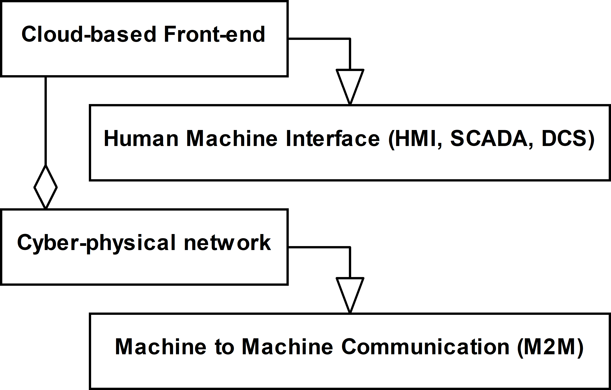
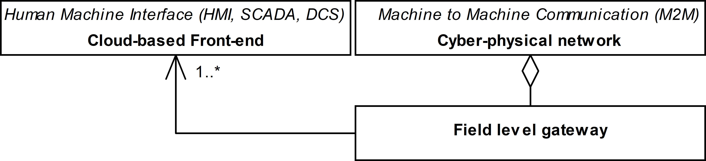
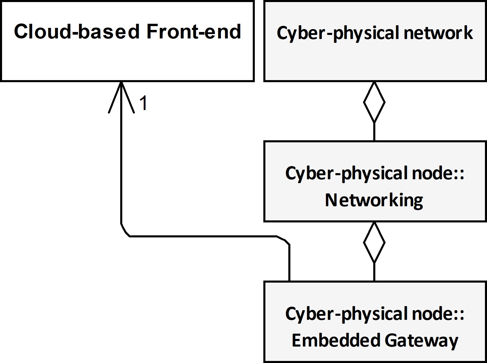
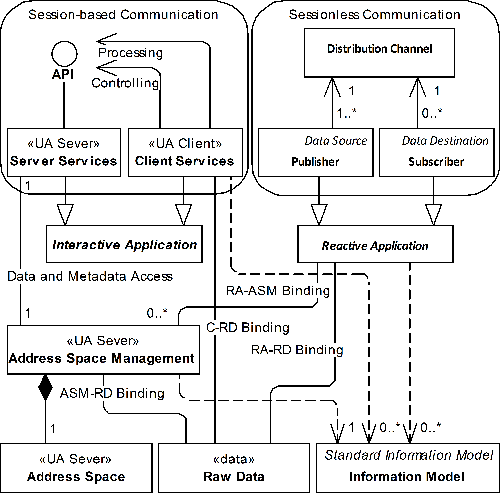
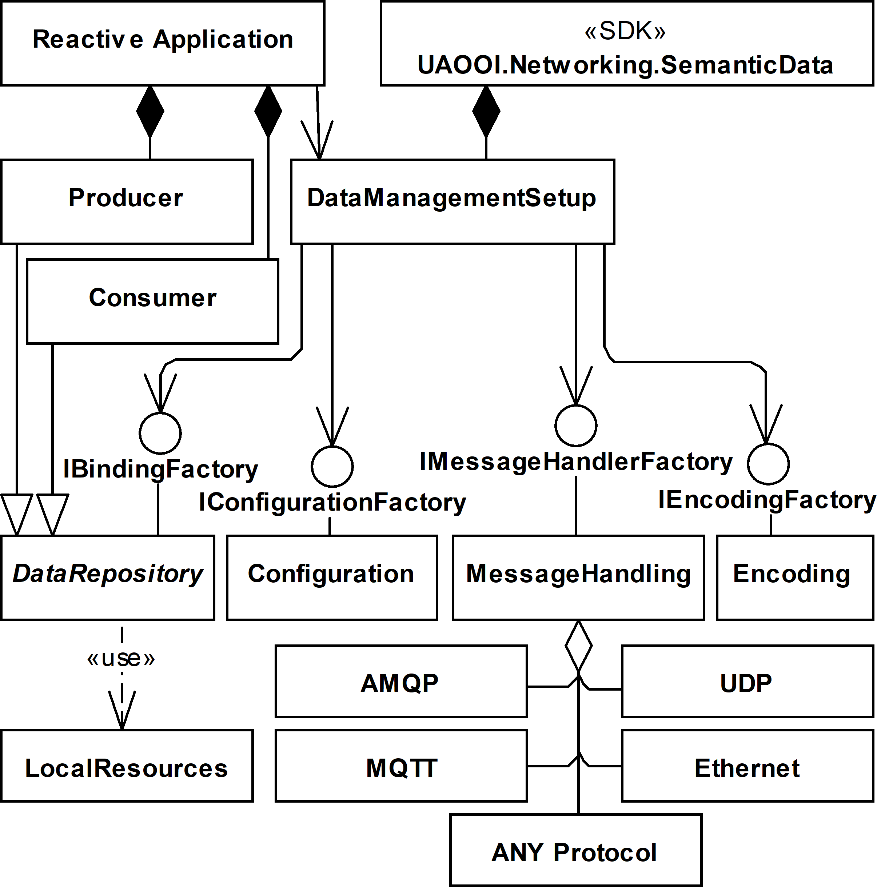
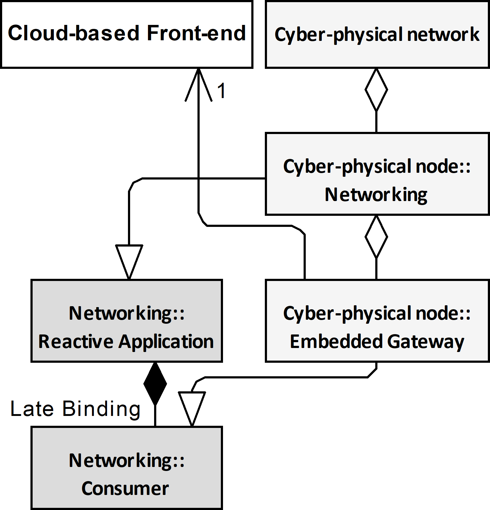
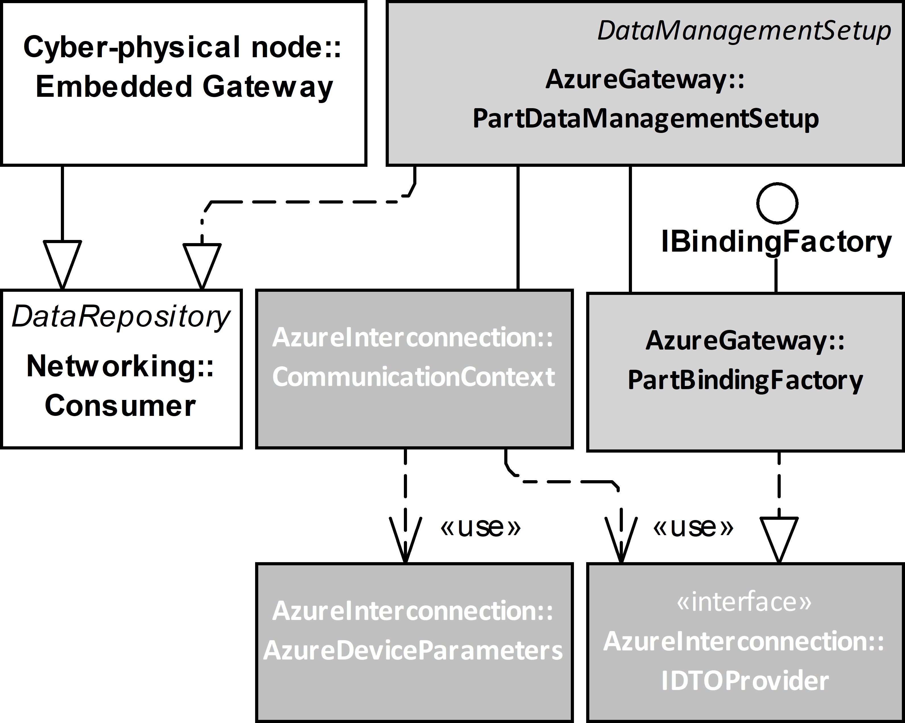

# Conference notes

## Executive summary

The document contains notes to prepare a conference presentation.

## Presentation

### Slide 1

#### Title

- Object-Oriented Internet Cloud Interoperability
- Mariusz Postół (mailto:mariusz.postol@p.lodz.pl)
- Piotr Szymczak
- Institute of Information Technology, Lodz University of Technology, Łódź, Poland

#### Notes 1

My name is Mariusz Postół and I am representing the Institute of Information Technology Lodz University of Technology. It is my pleasure to present my and Piotr Szymczak research work related to Object-Oriented Internet and Cloud services integration focusing on the generic architecture that is proposed to implement and deploy this interoperability scenario.

### Agenda

#### Slide 2

- Topic 1
- Topic 2

#### Notes 2

To keep your attention let me present the agenda for my presentation. At the very beginning, let's describe the scope of my research. I am going to talk about highly distributed industrial processes. It is very broad application domain that includes but it is not limited to Industrial Internet of Things and smart factory concepts. There is no doubts that nowadays systems like that must be designed and deployed considering multivanom environment. It makes standardization especially important.

____
 smart factory Talking about M2M communication I will try to point out the most important in my opinion features of this application domain.

Because the Industry 4.0, IoT, and in general cyber-physical developed based on the M2M may bother with the problems related to:

- traffic asymmetry
- data holder mobility
- Multi-vendor environment

I will investigate the possibility to engage the Reactive Communication instead of Interactive communication.

To make my proposals adaptable by end-users I will propose details making the presented abstract model a foundation for further development in this respect.
____

### Industrial highly distributed applications - human role

#### Slide 20

- Human-centric - information origin or ultimate information destination is an operator
  - GUI Based Human Interface
  - Robustness (errors tolerance) depends on human interaction
  - Cloud-base IoT front-end
- Machine-centric
  - Machine to Machine Communication (M2M) - information creation, consumption, networking, and processing are achieved entirely without human interaction
  - No human interaction possible to improve solution robustness
  - Cyber-physical systems base on Machine to Machine communication
  - OPC Unified Architecture to promote multi-vendor environment

#### Notes 20

Based on the role humans take while deploying smart factory concept the computer applications may be grouped as Human-centric and Machine-centric.

A typical human-centric approach is a web-service supporting a web user interface (UI) to monitor conditions and manage millions of devices and their data in a typical cloud-based internet of Things approach. In this case, it is characteristic that any uncertainty and necessity to make a decision can be relaxed by human interaction.

An example of the machine-centric scenario is the coordination of robot behavior in a work-cell. In this case, any human interaction must be recognized as impractical or even impossible. This interconnection scenario requires the machine to machine communication (M2M) demanding multi-vendor devices integration. In this case, the solution must be robust by design because no human interaction is applicable at run-time.

To promote composition using multi-vendor parts the standardization is especially important. Industry 4.0 is an initiative that addresses this application domain addressing  the Smart factory concept design and deployment. Thai concept is recognized as forth industrial revolution. Additionally, to adders interconnection and interoperability of the multi-vendor component parts the OPC Unified Architecture is considered to normalize reactive M2M communication.

The main goal of this article is to prove that the Object Oriented Internet cyber physical network can be interconnected with the Internet of Things cloud services:

- based on the OPC UA standard implemented as a powerful standalone library without dependency on the Client/Server session-oriented archetype,
- cloud interoperability can be implemented as an independent part employing out-of-band communication without dependency on the OPC UA implementation,
- the proposed generic architecture allows that the gateway functionality is implemented as a composable part at run-time - no programming required.

### Cyber-physical Systems Telemetry

#### Slide 25

- Integrated machines interconnected over the Internet
- Internet of Things (IoT)
- Data holder mobility:
  - Mobile Device - Network attachment point
  - Mobile Application - Serverless data access – reactive communication
  - Mobile Data - Random location of data publication
- Real-time processing
- semantic and security contexts

#### Notes 25

Going beyond the smart factory realm, a similar concept may be used to make any general-purpose entities interoperable. Finally, we get cyber-physical systems where a variety of entities may be aggregated into distributed information processing solutions. In this case, we are opening the public connectivity domain, which requires a globally scoped infrastructure, i.e. the Internet.

For any generic solution addressing the design of the cyber-physical system, the data holder mobility must be considered as well. Mobile data means that it may come from mobile devices or be generated in unpredictable attachment points. If the data places exposition is arbitrary it means that the data appearance must be recognized and processed as an event. A good example of this scenario is a product - for example drugs - global tracking system - an application domain where the IoT term has been coined. One of the arguments for the IoT is allowing distributed yet interlinked devices, machines, and objects (data holders) to interact with each other without relying on human interaction to set-up and commission the embedded intelligence.

In this kind of applications time must be considered as important contributor to the implemented algorithm.

In case any kind of mobility has to be considered, the next engineering challenge is dynamic discoverability on the network and the possibility of establishing the semantic and security contexts of the parts composing the IoT application.

### Direct Interconnection Interoperability Scenario

#### Slide 30

#### Notes 30

To promote reusability the research must be conducted atop of a formal description. The proposed solution and all intermediate steps illustrating how to derive the final solution from the selected domain features are described by means of the UML that is a well known and widely used language for this purpose. Finally the workout is abstract enough to be reused in any development environment. As a proof of concept we published two implementations as the open source.

Before conducting any further research, we must address the question about the relationship between the cloud-based frond-end and cyber-physical network, and the first natural option is direct interconnection. By design, the direct interconnection approach requires that the cloud has to be compliant with the interoperability standard the cyber-physical system is based on.

This approach is not practical, became by design, the cloud-based services require that for interconnection preparation and data interchange a session over the Internet has to be established by the data holding assets. Contrary to this, Machine to machine communication is usually constrained by real-time requirements to use protocols applicable only to local computer networks (e.g. multicast IP, Ethernet, TSN 1, etc.).

Concluding, it si obvious that because the cloud services support only communication over the Internet the direct interconnection cannot be applied in a general case.

### Edge Interconnection Interoperability Scenario

#### Slide 40

#### Notes 40

An edge entity is a remote cloud agent acting as an intermediary for nodes of the cyber-physical system. It is a consistent part of cloud-based frond-end services. Main disadvantage of this solution is possibility to support interconnection with only one cloud.

### Field Level Gateway Interoperability Scenario

#### Slide 50

#### Notes 50

Field level gateway is a dedicated custom agent acting as an intermediary for nodes connected to the cyber-physical system. This solution is not constrained by the cloud vendor communication context and as the result may be used to handle communication with a variety of clouds. Still, this solution is constrained to fulfill the gateway functionality only.

### Embedded Gateway Interoperability Scenario

#### Slide 60

#### Notes 60

We propose a new architecture derived from the field-level approach but not constrained to gateway functionality only. The embedded-gateway is only a composed part of the Networking services of a cyber-physical node. In this approach it may be assumed that the gateway functionality is only an add-iin to expand typical functionality of the node including but not limited to establishing semantic and security context with the other nodes connected to the cyber-physical network. The responsibility of the Embedded Gateway is to establish communication context with the cloud-based frond-end and conduct the selected data transfer in compliance with this context.

composable to any Cyber-physical node it could be deployed far after designing and deploring of the hosting cyber-physical node. The only requirement that constrains this approach is a common abstract contract usually expressed as an interface that the embedded gateway must be compliant with to be aggregated to the whole. In other words, in the proposed solution, the gateway is loosely coupled with the node contrary to the Edge and Field-level approaches where the gateway functionality is an embedded part of the host. It improves flexibility, reusability, and in general maintenance cost.

The proposals are backed by proof-of-concept reference implementations confirming the possibility of integrating selected cloud services with the OPC UA based cyber-physical system by applying the proposed architecture and deployment scenario. It is contrary to interconnecting cloud services with the selected OPC UA Server limiting the PubSub role to data export only.

### Sessionless (Reactive communication) vs Session Oriented (Interactive communication)

#### Slide 70

#### Notes 70

We believe or even claim that the proposed architecture can be applied to any type of the cyber-physical network. In independent publications you can find in-depth analysis of the interactive - based on the client-server relationship - and reactive - based on the publisher - subscriber interaction applications archetypes. Both must be recognized as not compliant environment therefore to conduct any prototyping we must select one of them. We selected reactive interoperability based on the OPC Unified Architecture PubSub international standard that relaxes issues related to the real-time multi-vendor environment, network traffic asymmetry and data holder mobility.

In-dept analysis of this topic is far beyond the presentation scope. To get more details check out my previous publications.

### Reactive interoperability implementation

### Slide 80

### Notes 80

To start prototyping we did use a library call UAOOI.Networking.SemanticData - networking for short. This library offers a generic implementation of the mentioned OPC Unified Architecture PubSub standard. It is generic because allows to select one of the transport protocols allowed by the spec to connect the node to other nodes attache to common cyber-physical network. Additionally, using a different implementation of the Encoding component many variants of the NetworkMessage compliant with the spec is configurable and may be aggregated by the library at run-time. Encoding and underling protocol stack are responsible to support in-band machnie to machine communication.

In the proposed solution process data binding is offered by the DataRepository , which implements tha IBindingFactory interface. The  Producer and Consumer roles are derive from it to support bidirectional data exchange with the underlying real process. By design, they support access to real-time process data. Independent implementations of these roles can be composed by the Reactive Application using the dependency injection programming technique. It is in compliance with the separation of concerns programming paradigm.

### Implementation Domain Model

#### Slide 90

#### Notes 90

This diagram is derived by merging previously presented onces and removing not relevant for for further discussion members. According to this diagram, our implementation of the Consumer role has been used to provide embedded gateway functionality and out-of-band communication with cloud services to transfer data to Azure IoT Central solution. The detailed description of this solution design is not relevant for further discussion, so I will skip it.

The most important feutre here is that the Reactive application uses late binding to compose the custom implementation of the gateway. As I said previously it allows to implement this role evan after deploying the hosting application. In other words current Consumer implementation is injected part of the Reactive Application compliant with the OPC UA PubSub. Using other implementations of the Producer/Consumer roles a vast variety of functionality can  be provided as the same time.

Using many different Consumer role implementations it is possible to get connected to any cloud services using out-of-band communication compliant with cloud services connectivity requirements. Our prototyping addresses only Azure interoperability as just an example.

It is worth stressing that the hosting application of the embedded gateway part based on the Consumer functionality is a fully functional member of the Cyber-physical Network.

### Implementation Architecture

#### Slide 100

#### Notes 100

### Cloud Communication Context

#### Slide 110

Implementation contains two major components, namely CommunicationContext and PartBindingFactory. PartBindingFactory is responsible to groupe and process the data recovered from the messages exchanged over the network. Integrating these two different environments we must assume that metadata used to describe the data exchanged over the cyber-physical networks and the date exposed by the cloud solution are not compliant. For example, to be compliant with the specification the first must be described using encoding required by the OPC Unified Architecture spec parts 6 and 14. On the other hand the cloud solution metadata may be described using Digital Tween Description Language. In other words these two environment uses different domain specific languages to describe syntax and semantics of the process data. Therefore, based on the bitstreams meaning this class of the gateway must be also responsible to provide mapping at run time. The result of mapping is converted to Data Transfer Object using JSON serialization. This Data Transfer object factoring mechanism must be conducted at every time new data is to be send to the cloud, but behavior implementation of the mapping may be considered as the design time activity in a typical case.

CommunicationContext class sends the factored Data Transfer Objects using communication channel established in advance. The data Transfer object is retrieved from the PartBindingFactory using the IDTOProvider interface.

The CommunicationContext maintains the data transfer channel with the cloud services using well known state machine pattern. It is responsible for protocols stack selection, authentication, and autorotation of a session created to establish a communication channel. The encoded JSON messages must be transferred to cloud over the network using the selected protocol stack. The Azure supports HTTP, AMQP, and MQTT protocol stacks, which are all standard ones. It means that they have appropriate specification documentation. Consequently, it is possible to apply any available implementation compliant with an appropriate specification to achieve connectivity. In this case, all parameters required to establish connectivity  and security contexts are up to the gateway responsibility. Alternatively, the API offered by the dedicated frameworks (libraries) may be used. Using a framework, the configuration process may be reduced significantly, and the communication protocol selection has only an indirect impact on the interoperability features. In the proposed implementation, the Azure interconnection has been obtained using the above mentioned frameworks.

Azure and PubSub use different security mechanisms so in the proposed solution establishing security-context is realized independently using the configuration. The CommunicationContext is responsible for establishing the connectivity and security contexts as at the negotiation phase.

#### Notes 110

### Proof of concept (pilot projects)

evidence, typically derived from an experiment or pilot project, which demonstrates that a design concept, business proposal, etc., is feasible.

the company was awarded the contract on the strength of evaluation, proof of concept, and budget

### Conclusions

- The discussion concludes that the embedded gateway software component best suits all requirements and thus has been implemented as a composable part of the selected reactive OPC UA framework which promotes separation of concerns and reusability.

## Future work

- OPC UA Server Embedded Gateway
- OPC UA Client Emended Gateway
- semantic mapping
- gateway on a stick - self contained application without cyber physical Network interoperability. Data gathered by the producer is send to cloud using the Consumer role implemented to fulfill the gateway functionality. 