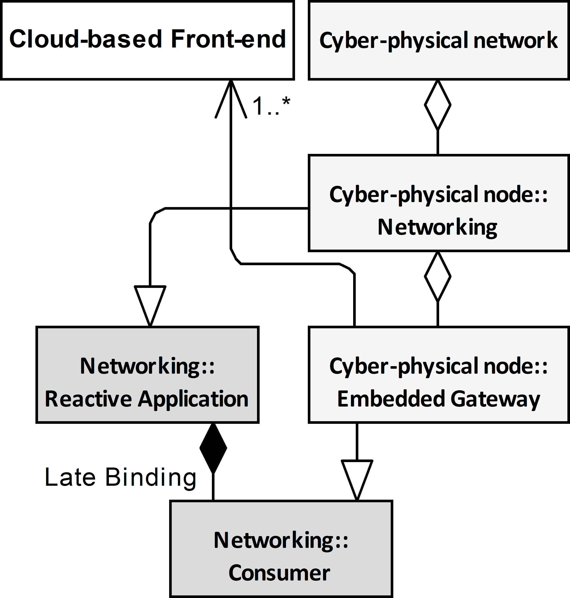

# Conference notes  <!-- omit in toc -->

## Executive summary  <!-- omit in toc -->

- [Presentation](#presentation)
  - [Frond page](#frond-page)
    - [Slide 10](#slide-10)
    - [Notes 10](#notes-10)
  - [Industrial highly distributed applications - human role](#industrial-highly-distributed-applications---human-role)
    - [Slide 20](#slide-20)
    - [Notes 20](#notes-20)
  - [Telemetry => Cyber-physical Systems](#telemetry--cyber-physical-systems)
    - [Slide 25](#slide-25)
    - [Notes 25](#notes-25)
  - [Direct Interconnection Interoperability Scenario](#direct-interconnection-interoperability-scenario)
    - [Slide 30](#slide-30)
    - [Notes 30](#notes-30)
  - [Edge Interoperability Scenario](#edge-interoperability-scenario)
    - [Slide 40](#slide-40)
    - [Notes 40](#notes-40)
  - [Field Level Gateway Interoperability Scenario](#field-level-gateway-interoperability-scenario)
    - [Slide 50](#slide-50)
    - [Notes 50](#notes-50)
  - [Embedded Gateway Interoperability Scenario](#embedded-gateway-interoperability-scenario)
    - [Slide 60](#slide-60)
    - [Notes 60](#notes-60)
  - [Implementation - proof of concept](#implementation---proof-of-concept)
    - [Slide 110](#slide-110)
    - [Notes 110](#notes-110)
  - [Proof of concept (pilot projects)](#proof-of-concept-pilot-projects)
    - [Slide 120](#slide-120)
    - [Notes 120](#notes-120)
  - [Sessionless (Reactive communication) vs Session Oriented (Interactive communication)](#sessionless-reactive-communication-vs-session-oriented-interactive-communication)
    - [Slide 70](#slide-70)
    - [Notes 70](#notes-70)
  - [Reactive interoperability implementation](#reactive-interoperability-implementation)
  - [Slide 80](#slide-80)
  - [Notes 80](#notes-80)
  - [Implementation Domain Model](#implementation-domain-model)
    - [Slide 90](#slide-90)
    - [Notes 90](#notes-90)
  - [Implementation Architecture](#implementation-architecture)
    - [Slide 100](#slide-100)
    - [Notes 100](#notes-100)
  - [Further work](#further-work)
    - [Slide 130](#slide-130)
    - [Notes 130](#notes-130)
  - [Thank you](#thank-you)
    - [Notes 140](#notes-140)
The document contains notes to prepare a conference presentation.

## Presentation

### Frond page

#### Slide 10

- ICCS 2021: INTERNATIONAL CONFERENCE ON COMPUTATIONAL SCIENCE
- 17-06-2021 Computational Science in IoT and Smart Systems
- Object-Oriented Internet Cloud Interoperability
- Mariusz Postół (mailto:mariusz.postol@p.lodz.pl)
- Piotr Szymczak
- Institute of Information Technology, Lodz University of Technology, Łódź, Poland

#### Notes 10

My name is Mariusz Postół and I am representing the Institute of Information Technology Lodz University of Technology. It is my pleasure to present my and Piotr Szymczak research work related to Object-Oriented Internet and Cloud services integration focusing on the generic architecture that is proposed to implement and deploy this interoperability scenario.

### Industrial highly distributed applications - human role

#### Slide 20

- Human-centric - information origin or ultimate information destination is an operator
  - GUI Based Human Interface
  - Robustness (errors tolerance) depends on human interaction
  - Cloud-base IoT front-end
- Machine-centric - information creation, consumption, networking, and processing are achieved entirely without human interaction
  - Machine to Machine Communication (M2M)
  - No human interaction possible to improve solution robustness
  - Cyber-physical systems baseD on Machine to Machine communication
  - OPC Unified Architecture to promote multi-vendor environment

#### Notes 20

Based on the role humans take while deploying the smart factory concept the computer applications may be grouped as Human-centric and Machine-centric.

A typical human-centric approach is a web service supporting a web user interface (UI) to monitor conditions and manage millions of devices and their data in a typical cloud-based Internet of Things approach. In this case, it is characteristic that any uncertainty and necessity to make a decision can be relaxed by human interaction.

An example of a machine-centric scenario is the coordination of robot behavior in a work cell. In this case, any human interaction must be recognized as impractical or even impossible. This interconnection scenario requires machine-to-machine communication (M2M) demanding multi-vendor device integration. In this case, the solution must be robust by design because no human interaction is applicable at run-time.

To promote composition using multi-vendor parts the standardization is especially important. Industry 4.0 is an initiative that addresses this application domain addressing the Smart factory concept design and deployment. That concept is recognized as the fourth industrial revolution. Additionally, to adders interconnection and interoperability of the multi-vendor parts the OPC Unified Architecture is considered to normalize reactive M2M communication.

The main goal of this article is to prove that the Object-Oriented Internet cyber-physical network can be interconnected with the Internet of Things cloud services:

- based on the OPC UA standard implemented as a powerful standalone library without dependency on the Client/Server session-oriented archetype,
- cloud interoperability can be implemented as an independent part employing out-of-band communication without dependency on the OPC UA implementation,
- the proposed generic architecture allows that the gateway functionality is implemented as a composable part at run-time - no programming required.

### Telemetry => Cyber-physical Systems

#### Slide 25

- Integrated machines interconnected over the Internet
- Internet of Things (IoT)
- Data holder mobility:
  - Mobile Device - Network attachment point
  - Mobile Application - Serverless data access – reactive communication
  - Mobile Data - Random location of data publication
- Real-time processing
- semantic and security contexts

#### Notes 25

Going beyond the smart factory realm, a similar concept may be used to make any general-purpose entities interoperable. Finally, we get cyber-physical systems where a variety of entities may be aggregated into distributed information processing solutions. In this case, we are opening the public connectivity domain, which requires a globally scoped infrastructure, i.e. the Internet.

For any generic solution addressing the design of the cyber-physical system, the data holder mobility must be considered as well. Mobile data means that it may come from mobile devices or be generated in unpredictable attachment points. If the data place exposition is arbitrary it means that the data appearance must be recognized and processed as an event. A good example of this scenario is a product - for example, drugs - global tracking system - an application domain where the IoT term has been coined. One of the arguments for the IoT is allowing distributed yet interlinked devices, machines, and objects (data holders) to interact with each other without relying on human interaction to set up and commission the embedded intelligence.

In this kind of application, time must be considered as an important contributor to the implemented algorithm.

In case any kind of mobility has to be considered, the next engineering challenge is dynamic discoverability on the network and the possibility of establishing the semantic and security contexts of the parts composing the IoT application.

### Direct Interconnection Interoperability Scenario

#### Slide 30

#### Notes 30

To promote reusability the research must be conducted atop of a formal description. The proposed solution and all intermediate steps illustrating how to derive the final solution from the selected domain features are described using the UML. Finally, the workout is abstract enough to be reused in any development environment. 

On the other hand, we published two open-source implementations as proof of concept.

Before conducting any further research, we must address the question about the relationship between the cloud-based frond-end and cyber-physical network, and the first natural option is direct interconnection. By design, the direct interconnection approach requires that the cloud has to be compliant with the interoperability standard the cyber-physical system is based on.

This approach is not practical, became by design, the cloud-based services require that for interconnection preparation and data interchange is conducted over the Internet. Contrary to this, machine-to-machine communication is usually constrained by real-time requirements to use protocols applicable only to local computer networks (for example multicast IP, Ethernet, TSN, etc.).

Concluding, it is obvious that because the cloud services support only communication over the Internet the direct interconnection cannot be applied in a general case.

### Edge Interoperability Scenario

#### Slide 40

#### Notes 40

An edge entity is a remote cloud agent acting as an intermediary for nodes of the cyber-physical system. It is a consistent part of cloud-based frond-end services. The main disadvantage of this solution is the possibility to support interconnection with only one cloud service.

### Field Level Gateway Interoperability Scenario

#### Slide 50

#### Notes 50

Field level gateway is a dedicated custom agent acting as an intermediary for nodes connected to the cyber-physical network. This solution is not constrained by the cloud vendor communication context and as the result may be used to handle communication with a variety of clouds. Still, this solution is constrained to fulfill the gateway functionality only.

### Embedded Gateway Interoperability Scenario

#### Slide 60

#### Notes 60

We propose a new architecture derived from the field-level approach but not constrained to gateway functionality only. The embedded gateway is only a composed part of the Networking services of a cyber-physical node. In this approach, it may be assumed that the gateway functionality is only an add-in to expand the typical functionality of the node including but not limited to establishing semantic and security context with the other nodes connected to the cyber-physical network. The responsibility of the Embedded Gateway is to establish communication context with the cloud-based frond-end and conduct the selected data transfer in compliance with the context.

Embedded Gateway is composable to any Cyber-physical node. It is worth stressing that it could be deployed far after designing and deploring the hosting cyber-physical node. The only requirement that constrains this approach is a common abstract contract usually expressed as an interface that the embedded gateway must be compliant with to be aggregated to the whole. In other words, in the proposed solution, the gateway is loosely coupled with the node contrary to the edge and field-level approaches where the gateway functionality is tightly coupled (say embedded) with the host. It improves flexibility, reusability, and in general maintenance cost.

### Implementation - proof of concept

#### Slide 110

- To promote and leverage
  - Reusability – using the same part in many scenarios
  - Flexibility 
  - Deployment without programming
- The following design patterns are applied
  - Separation of concerns
  - Dependency injection
  - Adaptive Programming
- To promote Interoperability in the multi-vendor environment the proposed proof of concept is compliant with the OPC UA Part 14 PubSub

#### Notes 110

It is a theory abstracting a generic solution meeting community expectations. In other words, it is just a set of assumptions that now we can use to propose a concrete implementation meeting the assumption. I believe that a detailed description of the implementation is not relevant to us in contrast to an analysis of how to use the proposed domain model to make strategic design decisions and functionality distribution. From the above discussion we can learn that the main design decisions must concern reusability (it means using the same part in many scenarios), flexibility, interoperability in the multi-vendor environment, and last but not least deployment without programming.

To meet these requirements the mentioned on the scree design patterns have been used.

- Separation of concerns - to allow independent development of the parts.
- Dependency injection - to allow late binding of independently implemented parts.
- Adaptive Programming is used at the development and deployment stage to improve the adaptability of the program against changes in the production environment.

Piece-by-piece integration of a cyber-physical system using multi-vendor products requires that machine-to-machine communication employs international standards as the interoperability foundation. Following the presented conclusions, OPC Unified Architecture Part 14 PubSub is selected in this respect. By design, this standard should support the required publisher-subscriber communication pattern, but it covers only partially the requirements of the applications concerned. Therefore, our proposals shall be recognized as far beyond the specification scope, although they are still compliant with the standard.

### Proof of concept (pilot projects)

#### Slide 120

#### Notes 120

As I stressed previously, the proposal is backed by proof of concept reference implementations. Prototyping addresses Microsoft Azure cloud services as an example. The outcome has been just published on GitHub as the open-source (MIT licensed) repository. The proposed solutions have been harmonized with the more general concept called the Object-Oriented Internet.

### Sessionless (Reactive communication) vs Session Oriented (Interactive communication)

#### Slide 70

#### Notes 70

We believe or even claim that the proposed architecture can be applied to any type of cyber-physical network. This diagram presents possible options but the detailed description you can find in the independent publication. Just simplifying, we must select between interactive (based on the client-server relationship) and reactive (based on the publisher-subscriber relationship) applications archetypes. Both must be recognized as not compliant environments therefore to conduct any prototyping we must select one of them. We selected reactive interoperability (yellow box) based on the OPC Unified Architecture PubSub international standard that relaxes problems related to the real-time multi-vendor environment, network traffic asymmetry, and data holder mobility.

### Reactive interoperability implementation

### Slide 80

### Notes 80

To start prototyping we did use a library called UAOOI.Networking.SemanticData - networking for short. This library offers a generic implementation of the mentioned OPC Unified Architecture PubSub standard. It is generic because allows selecting one of the transport protocols allowed by the spec to connect the node to other nodes attached to the common cyber-physical network. Additionally, using a different implementation of the Encoding component many variants of the NetworkMessage compliant with the spec are configurable and may be aggregated by the library at run-time. Encoding and underling protocol stack are responsible to support in-band machine-to-machine communication. Concluding, these composable parts are responsible to handle cyber-physical network communication.

In the proposed solution process data binding is offered by the DataRepository , which implements tha IBindingFactory interface. The  Producer and Consumer roles are derive from it to support bidirectional data exchange with the underlying real process. By design, they support access to real-time process data. Independent implementations of these roles can be composed by the Reactive Application using the dependency injection programming technique. It is in compliance with the separation of concerns programming paradigm.

### Implementation Domain Model

#### Slide 90

#### Notes 90

This diagram is derived by merging previously presented ones and removing irrelevant for further discussion members. According to this diagram, our implementation of the Consumer role has been used to provide embedded gateway functionality and out-of-band communication with cloud services to transfer data to Azure IoT Central solution. The detailed description of this Azure solution design is irrelevant for further discussion, so I will skip it.

The most important feature here is that the Reactive application uses late binding to compose the custom implementation of the gateway. As I said previously it allows implementation of this role even after deploying the hosting application. In other words, current Consumer implementation is injected part of the Reactive Application compliant with the OPC UA PubSub. Using other implementations of the Producer/Consumer roles means that a vast variety of functionality can be provided at the same time.

Using many different Consumer role implementations it is possible to get connected to any cloud services using out-of-band communication compliant with cloud services connectivity requirements. Our prototyping addresses only Azure interoperability as just an example.

It is worth stressing that the hosting application of the embedded gateway part based on the Consumer functionality is a fully functional member of the Cyber-physical Network.

### Implementation Architecture

#### Slide 100

#### Notes 100

Implementation contains two major components, namely CommunicationContext and PartBindingFactory.

PartBindingFactory is responsible for grouping and processing the data recovered from the messages exchanged over the network. Integrating these two different environments we must assume that metadata used to describe the data exchanged over the cyber-physical networks and the data exposed by the cloud solution are not compliant. For example, to be compliant with the specification the cyber-physical data exchange must be described using encoding required by the OPC Unified Architecture spec defined in parts 6 and 14 that offer a few incompatible alternatives. On the other hand, the cloud solution metadata may be described using Digital Tween Description Language that is also not stable. In other words, these two environments use different domain-specific languages to describe the syntax and semantics of the same process data.

Therefore, based on the bitstreams meaning this class of the gateway must be also responsible to provide mapping at run time. The result of the mapping is converted to Data Transfer Object using JSON serialization. This Data Transfer Object factoring mechanism must be conducted every time new data is to be sent to the cloud, but behavior implementation of the mapping may be considered as the design-time activity in a typical case.

CommunicationContext class sends the created Data Transfer Objects using a communication channel established in advance. The Data Transfer Object is retrieved from the PartBindingFactory using the IDTOProvider interface.

The CommunicationContext maintains the data transfer channel with the cloud services using a well-known state machine pattern. It is responsible for protocol stack selection, authentication, and authorization of a session created to establish a communication channel. The encoded JSON messages must be transferred to the cloud over the network using the selected protocol stack. The Azure supports HTTP, AMQP, and MQTT protocol stacks, which are all standard ones. It means that they have appropriate specification documentation. Consequently, it is possible to apply any available implementation compliant with an appropriate specification to achieve connectivity. In this case, all parameters required to establish connectivity and security contexts are up to the gateway's responsibility. Alternatively, the API offered by the dedicated frameworks (libraries) may be used. Using a framework, the configuration process may be reduced significantly, and the communication protocol selection has only an indirect impact on the interoperability features. In the proposed implementation, the Azure interconnection has been obtained using the above-mentioned frameworks.

Azure and PubSub use different security mechanisms so in the proposed solution establishing security-context is realized independently using the configuration. The CommunicationContext is responsible for establishing the connectivity and security contexts at the negotiation stage.

Finally, CommunicationContext uses out-of-band communication to send data to the cloud services.

### Further work

#### Slide 130

- Future research
  - OPC UA Server Embedded Gateway
  - OPC UA Client Emended Gateway
  - semantic mapping
  - gateway on a stick - self contained application without cyber physical Network interoperability. Data gathered by the producer is send to cloud using the Consumer role implemented to fulfill the gateway functionality.

#### Notes 130

My point is that this gateway experience may be easily ported to implement OPC UA Server and OPC UA Client gateway. A next topic that could be a good candidate for further work is a systematic approach to the semantic mapping between different domain-specific languages, namely languages defined by the OPC UA specification and Digital Tween Description Language that is to be used to define metadata on the Azure services.

Additionally, a gateway on the stick should be concerned, namely self-contained application without cyber-physical Network interoperability. In this case, data gathered by the producer is sent directly to the cloud using the Consumer role implemented to fulfill the gateway functionality.

### Thank you

#### Notes 140

That's all for now, thank you very much for your attention. We can open the Q/A session for my time slot.
