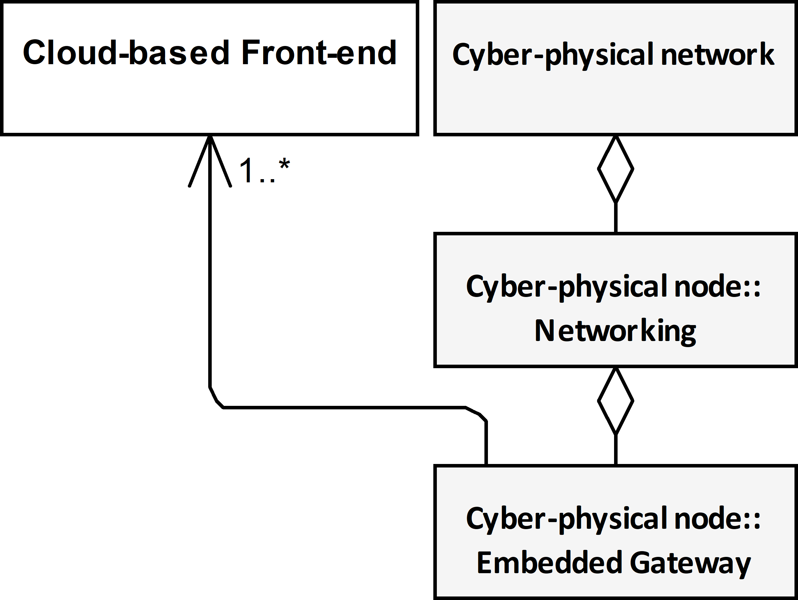
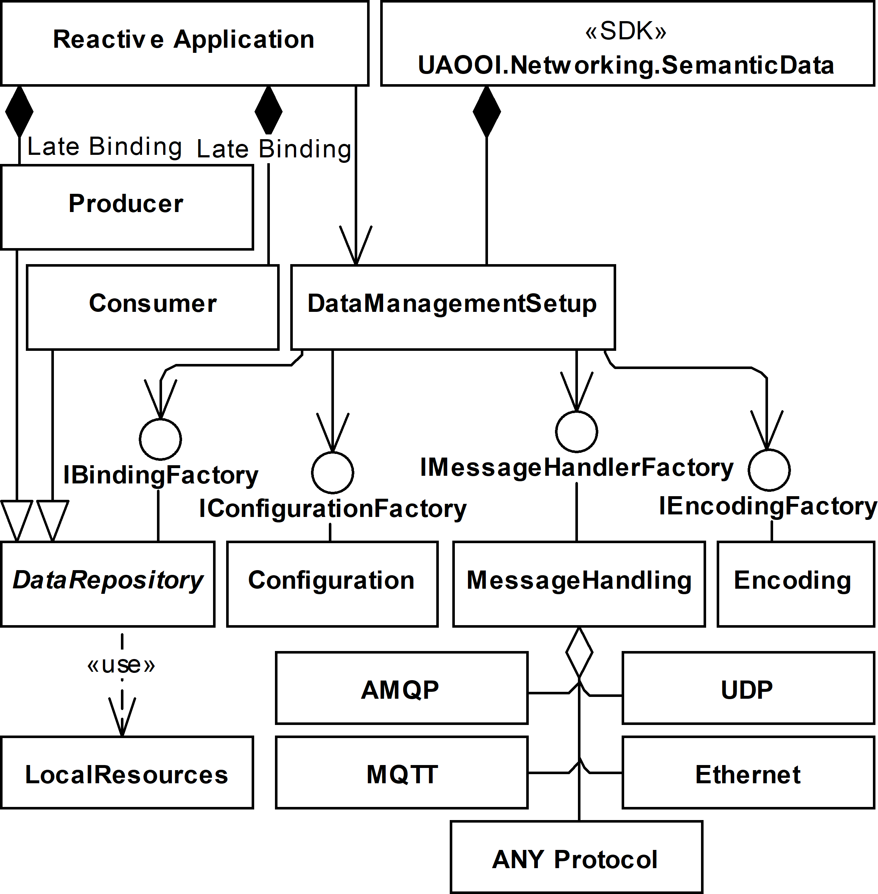

# Conference notes

## Executive summary

The document contains notes to prepare a conference presentation.

## Presentation

### Slide 1

#### Title

- Object-Oriented Internet Cloud Interoperability
- Mariusz Postół (mailto:mariusz.postol@p.lodz.pl)
- Piotr Szymczak
- Institute of Information Technology, Lodz University of Technology, Łódź, Poland

#### Notes 1

My name is Mariusz Postół and I am representing the Institute of Information Technology Lodz University of Technology. It is my pleasure to present my and Piotr Szymczak research work related to Object-Oriented Internet and Cloud services integration focusing on the generic architecture that is proposed to implement and deploy this interoperability scenario.

### Agenda

#### Slide 2

- Topic 1
- Topic 2

#### Notes 2

To keep your attention let me present the agenda for my presentation. At the very beginning, let's describe the scope of my research. I am going to talk about highly distributed industrial processes. It is very broad application domain that includes but it is not limited to Industrial Internet of Things and smart factory concepts. There is no doubts that nowadays systems like that must be designed and deployed considering multivanom environment. It makes standardization especially important.

____
 smart factory Talking about M2M communication I will try to point out the most important in my opinion features of this application domain.

Because the Industry 4.0, IoT, and in general cyber-physical developed based on the M2M may bother with the problems related to:

- traffic asymmetry
- data holder mobility
- Multi-vendor environment

I will investigate the possibility to engage the Reactive Communication instead of Interactive communication.

To make my proposals adaptable by end-users I will propose details making the presented abstract model a foundation for further development in this respect.
____

### Industrial highly distributed applications - human role

#### Slide 20

- Human-centric - information origin or ultimate information destination is an operator
  - Human Machine Interface (HMI)
  - Robustness (errors tolerance) depends on human interaction
  - Cloud-base IoT front-end
- Machine-centric
  - Machine to Machine Communication (M2M) - information creation, consumption, networking, and processing are achieved entirely without human interaction
  - No human interaction possible to improve solution robustness
  - Cyber-physical systems base on Machine to Machine communication

#### Notes 20

Based on the role humans take while deploying smart factory concept the embedded applications can be grouped as follows Human-centric and Machine-centric. To promote multi-vendor components supply chain the standardization is especially important. Industry 4.0 is an initiative that address this application domain. Smart factory concept is recognized as forth industrial revolution.

A typical human-centric approach is a web-service supporting, for example, a web user interface (UI) to monitor conditions and manage millions of devices and their data in a typical cloud-based IoT approach. In this case, it is characteristic that any uncertainty and necessity to make a decision can be relaxed by human interaction.

An example of the machine-centric scenario is the coordination of robot behavior in a work-cell. In this case, any human interaction must be recognized as impractical or even impossible. This interconnection scenario requires the machine to machine communication (M2M) demanding multi-vendor devices integration. In this case, the solution must be robust enough because no human interaction is expected.
____

- (Industry 4.0) multi-vendor environment
- communication: interconnection and interoperability
- OPC UA is required 
- proposed solutions ar compliant with this requirements

____

### Direct Interconnection Interoperability Scenario

#### Slide 30

#### Notes 30

To promote reusability the research must be conducted atop of a formal description. The proposed solution and all intermediate steps illustrating how to derive the final solution from the selected domain fetuses are described by means of the UML that is well known and widely used for this purpose language. Finally the workout is abstract enough to be reused in any development environment. As a proof of concept we published two implementations as the open source.

By design, the direct interconnection approach requires that the cloud has to be compliant with the interoperability standard the CPS uses. As a result, it becomes a consistent communication node of the CPS.

By design, the cloud-based services must be virtual - they are used to handle many solutions at the same time. As a result, the cloud services must be responsible to register and authenticate devices by exposing endpoints in the public network to allow the device to access a provisioning cloud service. It requires that a session over the Internet has to be established by the data holding asset at a preparation step.

Furthermore, M2M communication is usually constrained by real-time requirements. To meet the requirements of real-time distributed control the CPS may use protocols applicable only to local computer networks (e.g. multicast IP, Ethernet,
TSN 1, etc.).

Because the cloud services support only communication over the Internet the direct interconnection cannot be applied in a general case.

### Edge Interconnection Interoperability Scenario

#### Slide 40

#### Notes 40

An edge entity is a remote cloud agent acting as an intermediary for nodes of the CPS.

### Field Level Gateway Interoperability Scenario

#### Slide 50

#### Notes 50

Field level gateway is a dedicated custom agent acting as an intermediary for nodes of the CPS.

### Embedded Gateway Interoperability Scenario

#### Slide 60

#### Notes 60

For this integration, a new architecture is proposed to support the reactive relationship of communicating parties.

The proposals are backed by proof-of-concept reference implementations confirming the possibility of integrating selected cloud services with the OPC UA based cyber-physical system by applying the proposed architecture and deployment scenario. It is contrary to interconnecting cloud services with the selected OPC UA Server limiting the PubSub role to data export only.

### Sessionless (Reactive communication) vs Session Oriented (Interactive communication)

#### Slide 70

Reactive interoperability relaxes the interconnection problems

- network traffic asymmetry - limits of the network traffic propagation for the security reasons, for example, enforced by a firewall
- data holder mobility – due to data origin mobility the network node may need to move from one attachment point to another losing its previous endpoint address

#### Notes 70

This discussion presented in pervious research was concluded that only reactive interoperability can be used to overcome network traffic asymmetry and data holder mobility. Therefore the further work is concentrated on this communication scenario. Still, reusability of the existing concepts and solutions must be concerned.

- A reactive interoperability relationship of the communication parties is proposed to deal with the network traffic propagation asymmetry or assets’ mobility.
- Described solution based on the OPC Unified Architecture international standard relaxes issues related to the real-time multivendor environment.
- After dynamically attaching a new island of automation the control application (responsible for the data pulling) must be reconfigured for this interoperability scenario. In other words the interactive communication relationship cannot be directly applied because the control application must be informed on how to pull data from a new source.

### Reactive interoperability implementation

### Slide 80

### Notes 80

- encoding
- machine to machine communication
- configuration
- DataRepository (process data binding)
  - Consumer
  - Producer
  
### Implementation Domain Model

#### Slide 90

#### Notes 90

- Consumer as a injected part of the Reactive Application compliant with the OPC UA PubSub
- Embedded gateway part based on the Consumer functionality is a full functional member of the Cyber-physical Network

### Implementation Architecture

#### Slide 100

#### Notes 100

### Cloud Communication Context

#### Slide 110

- `CommunicationContext` based on state machine
  - protocol selection and send Data Transfer Object to Cloud
  - security context
- `PartBindingFactory`: IDTOProvide
  - semantic context
    - data grouping
    - data mapping
    - data serialization (JSON)
- `PartConfigurationFactory`
  - Application configuration

#### Notes 110

### Proof of concept (pilot projects)

evidence, typically derived from an experiment or pilot project, which demonstrates that a design concept, business proposal, etc., is feasible.

the company was awarded the contract on the strength of evaluation, proof of concept, and budget

### Conclusions

- The discussion concludes that the embedded gateway software component best suits all requirements and thus has been implemented as a composable part of the selected reactive OPC UA framework which promotes separation of concerns and reusability.

## Future work

- OPC UA Server Embedded Gateway
- OPC UA Client Emended Gateway
- 